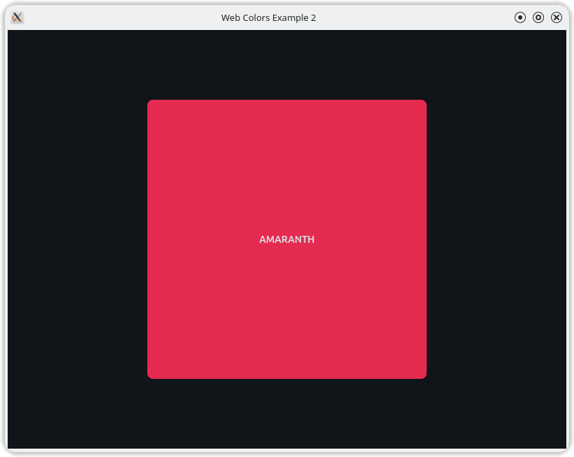

# Web Colors

just to help the developer to get many colors without remembering their hex value, and I think it's helpful to get the color with names this will be clear in the code instead hex value!

## Features

- Color Management: Simplifies access to colors by name.
- Code Clarity: Improves readability with named colors over hex values.
- Developer-Friendly: Eliminates the need to memorize hex codes.

## Usage

```python
WColors.RED # '#FF0000'
```

```python
import flet as ft
from flet_wcolors import WColors


def main(page: ft.Page):
    page.title = "Web Colors Example 2"
    page.vertical_alignment = ft.MainAxisAlignment.CENTER
    page.horizontal_alignment = ft.CrossAxisAlignment.CENTER

    page.window.width = 800
    page.window.height = 600

    page.add(
        ft.Container(
            width=400,
            height=400,
            bgcolor=WColors.AMARANTH,
            alignment=ft.alignment.center,
            border_radius=8,
            content=ft.Text(
                value = "AMARANTH"
            )
        )
    )

ft.app(target=main)
```

## Output of above code


